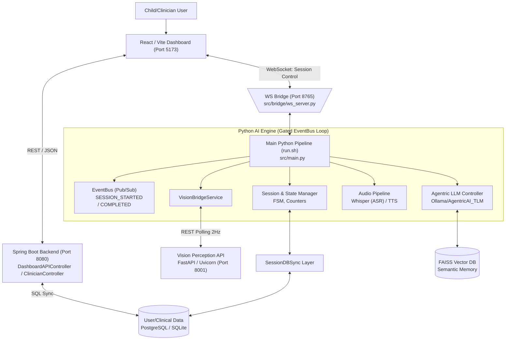
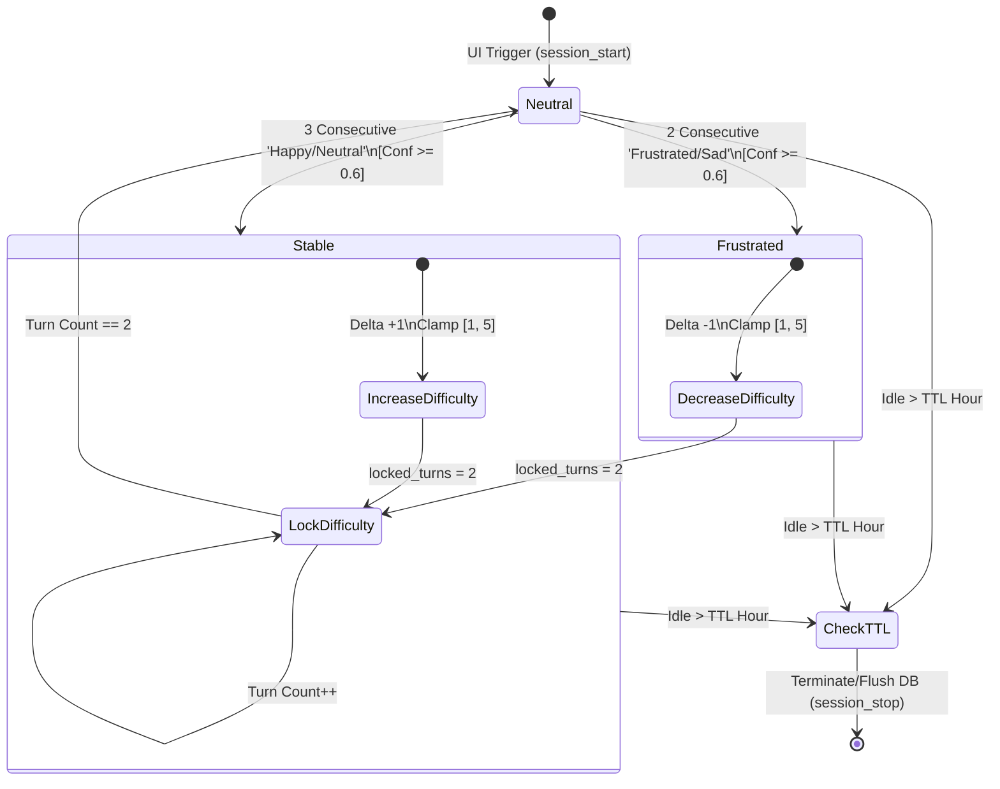
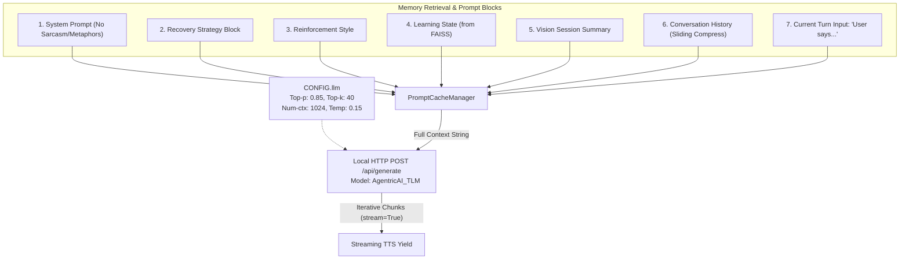
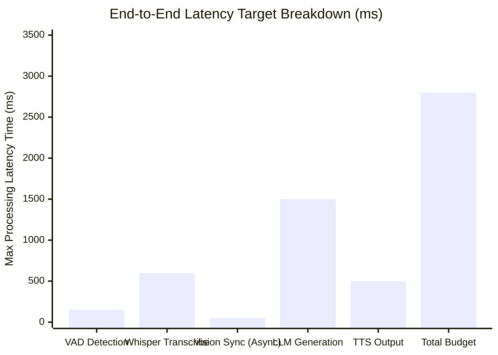
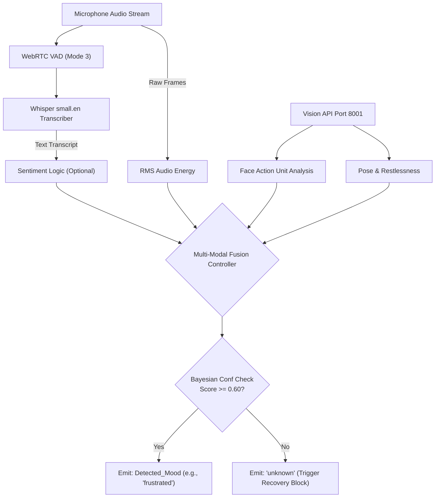
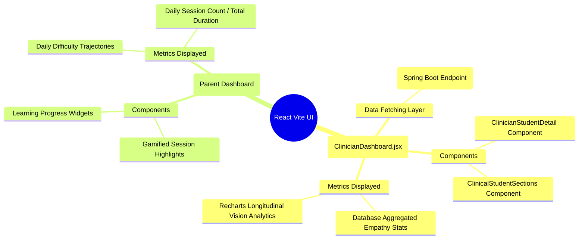
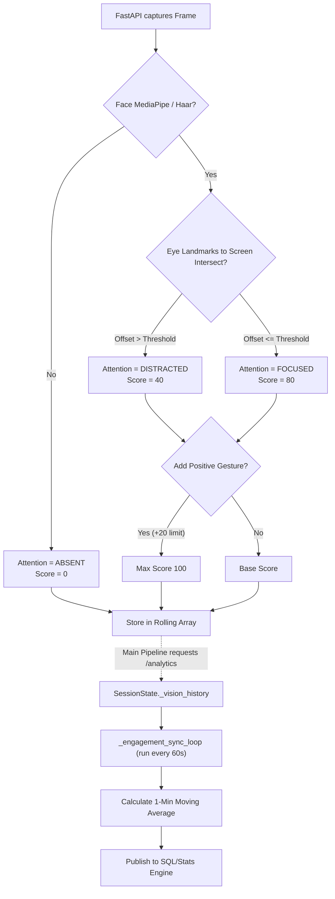

# LaRa Architecture Diagrams (Detailed View)

Below are the detailed architectural and data-flow diagrams for the LaRa system. These extend the high-level overviews to include specific technical protocols, backend services, ports, memory persistence layers, and internal configuration details.

## Figure 1: LaRa System Overview (Full Data-Flow Diagram)


## Figure 2: Vision Perception Pipeline (FastAPI to Main Sync)
```mermaid
graph TD
    Cam["Hardware Camera (15-30 FPS)"] --> Uvicorn["FastAPI App (Port 8001)"]
    
    subgraph VisionService ["FastAPI Vision Worker"]
        Uvicorn --> MediaPipe["MediaPipe FaceMesh/Pose"]
        MediaPipe --> |"Landmarks"| Tracker["Spatial Tracker"]
        
        Tracker --> Gaze{"Gaze Vector
        Intersection"}
        Gaze -->|Screen| FOC["FOCUSED"]
        Gaze -->|Away| DIST["DISTRACTED"]
        Gaze -->|None| ABS["ABSENT"]
        
        FOC --> BaseS["Score: 80-100"]
        DIST --> BaseS2["Score: 20-40"]
        ABS --> BaseS3["Score: 0"]
        
        BaseS --> SyncBuf["Rolling JSON Buffer"]
        BaseS2 --> SyncBuf
        BaseS3 --> SyncBuf
    end
    
    SyncBuf <-->|GET /analytics (0.5s Interval)| VisionBridge[\"Main Pipeline Vision Bridge"/]
    
    VisionBridge --> Aggregator["60-second Sliding Window
    Calculate Avg Engagement (120 samples)"]
    Aggregator -->|Publish: ENGAGEMENT_MINUTE_SYNC| EventBus["Core Event Bus"]
```

## Figure 3: Session State Machine (FSM & Configuration)


## Figure 4: 7-Segment Agentric Prompt Architecture


## Figure 5: Memory Architecture (3-Tier Layered Hierarchy)
```mermaid
graph LR
    subgraph L3 ["Layer 3: Semantic Memory (Disk/DB)"]
        FAISS["FAISS Index (Embeddings)"]
        SqlConfig["SQLite Schema / Policies"]
        ChildProf["Persistent Child Profiles"]
    end
    
    subgraph L2 ["Layer 2: Episodic Memory (Disk/JSON)"]
        DBSync["SessionDBSync Manager"]
        TurnJSON["Turn History JSON (session_id_state)"]
        Timeline["Timeline Metrics (1 min bins)"]
    end

    subgraph L1 ["Layer 1: Working Memory (RAM)"]
        SessionObj["SessionState Dataclass"]
        TurnCnt["Turn Counters & Emotion Streaks"]
        LockTimers["Difficulty Lock Timers"]
        
        SessionObj --> TurnCnt
        SessionObj --> LockTimers
    end
    
    L1 -->|"Debounced Save Trigger (2.0s timeout)"| L2
    L2 <--|"Metadata & Aggregates Extractions"| L3
```

## Figure 6: Latency Breakdown Chart 


## Figure 7: Emotion Detection Stack


## Figure 8: Dashboard Architecture (Clinical + Family Interfaces)


## Figure 9: Deployment Architecture (Hardware & Network Mapping)
```mermaid
graph TD
    subgraph Client ["Browser / Edge Device"]
        Vite["React Frontend SPA"] "--> HttpPort[Port: 5173]"
    end
    
    subgraph Spring ["Java Runtime"]
        Boot["Spring Boot Backend"] "--> ApiPort[Port: 8080]"
        Boot <--> |"JDBC / Hibernate"| DB
    end
    
    subgraph PyEnv ["Python Virtual Environment (.venv)"]
        Pipe["src/main.py Gated Pipeline"] "--> Ws[Port: 8765]"
        Pipe <--> EventBus["EventBus Manager"]
        Vis["src/vision_perception/app.py"] "--> Uvic[Port: 8001]"
    end
    
    subgraph DataStore ["Persistence Layer"]
        DB[("Postgres / SQLite
        port: 5432")]
        Vector[("FAISS Store")]
    end
    
    Client == "REST API" ==> Boot
    Client == "WebSocket" ==> Pipe
    Pipe == "REST API Polling" ==> Vis
```

## Figure 10: Engagement Scoring & Sync Flowchart

