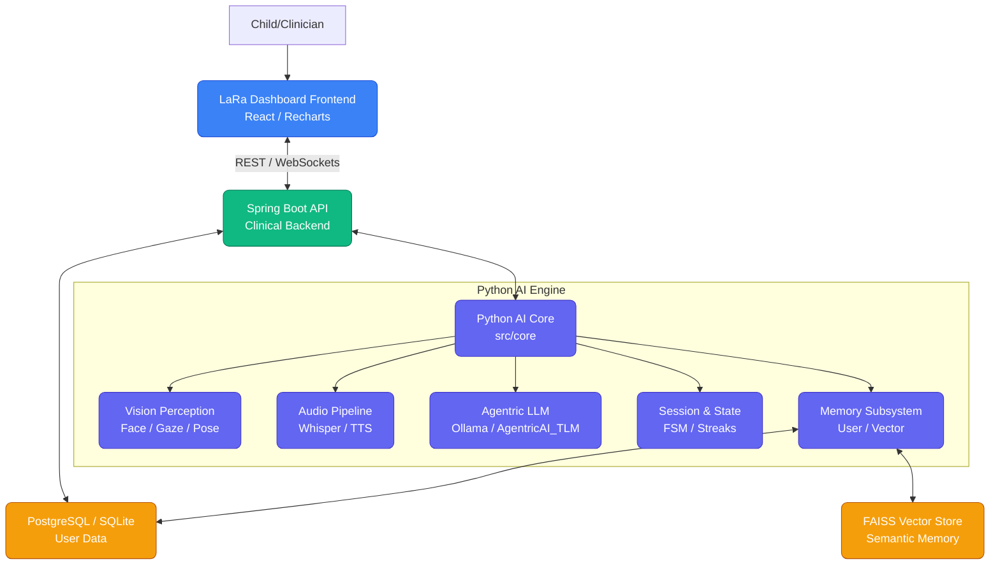
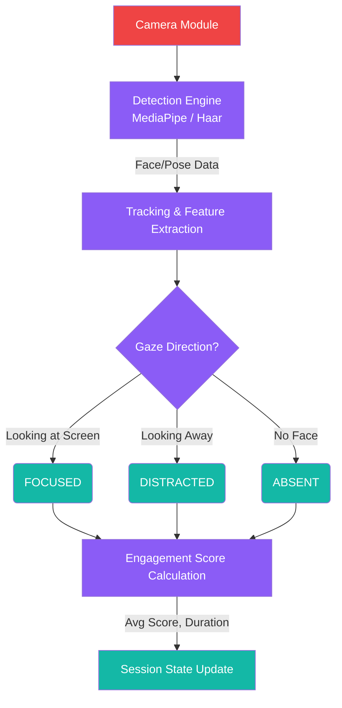
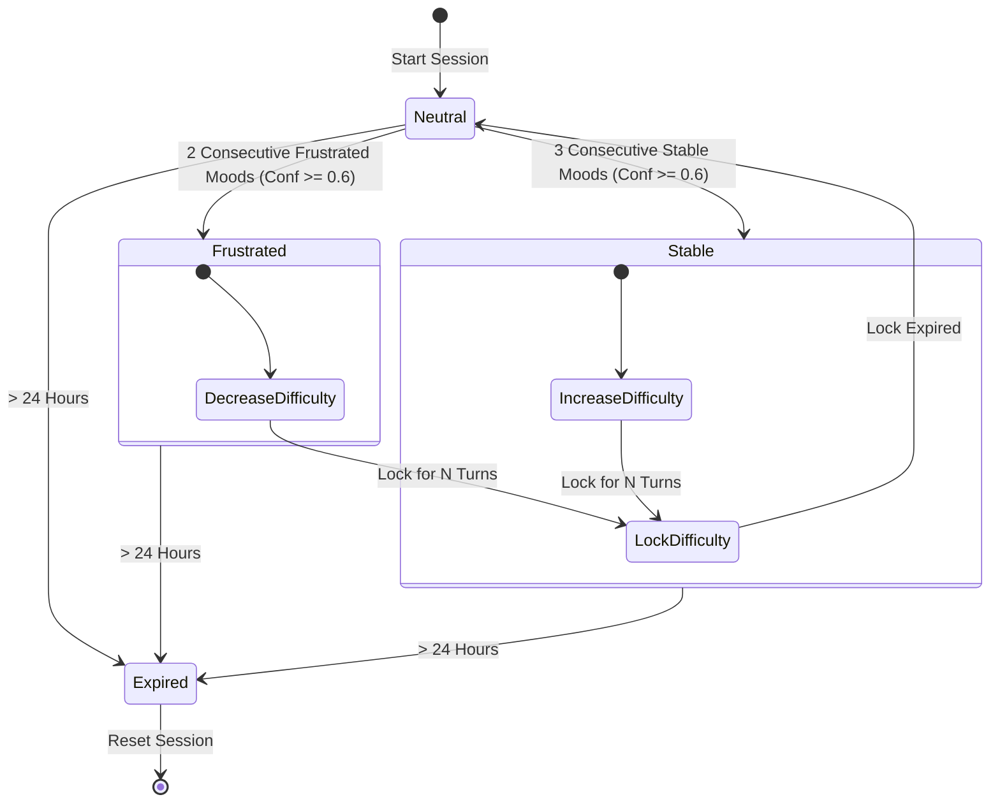
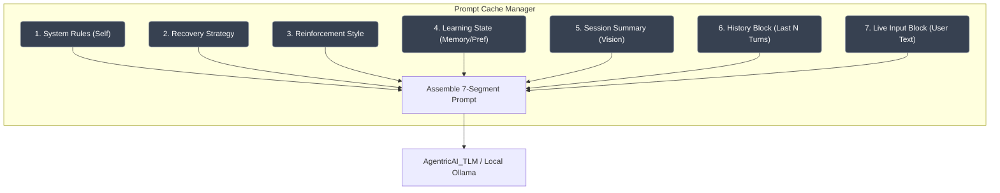
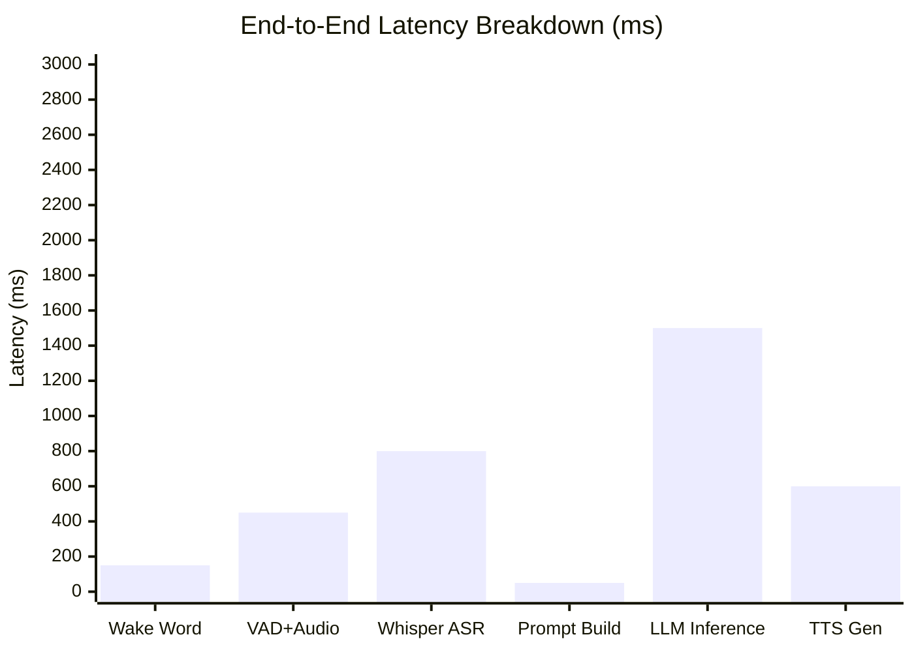
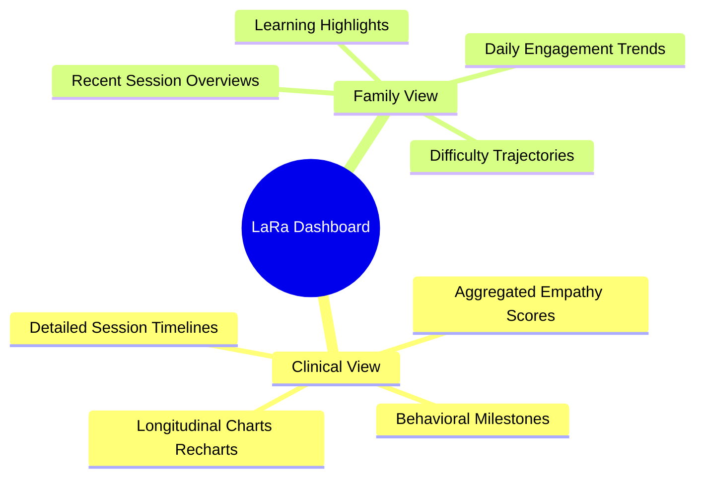
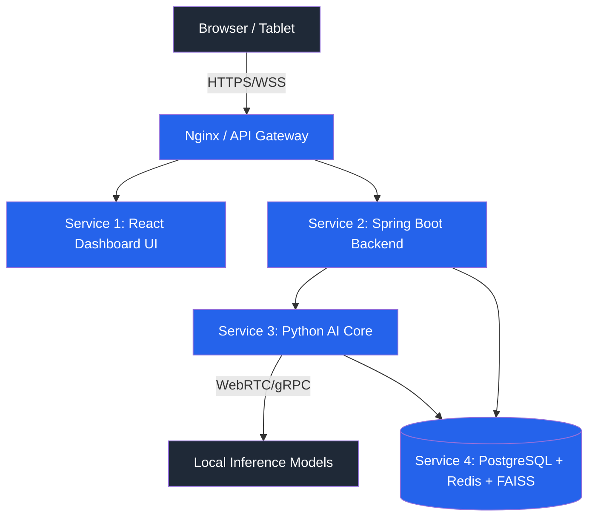
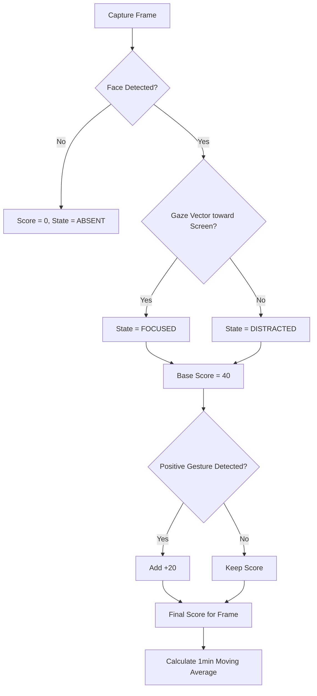

# LaRa Architecture Diagrams

Below are the architectural diagrams for the current version of the LaRa (Low-Cost Adaptive Robotic-AI Assistant) system, capturing all active engines, pipelines, and subsystems, rendered using Mermaid.

## Figure 1: LaRa System Overview (Full Block Diagram)


## Figure 2: Vision Perception Pipeline


## Figure 3: Session State Machine (FSM)


## Figure 4: 7-Segment Prompt Architecture


## Figure 5: Memory Architecture (3 Layers)
```mermaid
graph LR
    classDef layer fill:#ec4899,color:#fff;
    classDef comp fill:#475569,color:#fff;
    
    subgraph Layer 3: Semantic Memory (Persisted Semantic)
        VectorDB[FAISS Vector Store]:::layer
        ChildPref[Child Preferences]:::layer
    end
    
    subgraph Layer 2: Episodic Memory (Persisted Context)
        TurnHist[Turn History Database]:::layer
        VisionHist[Vision/Timeline Database]:::layer
    end

    subgraph Layer 1: Working Memory (In-Memory Session)
        Ses[SessionState (RAM)]:::layer
        Streaks[Frustration/Stability Counters]:::comp
        Mood[Current Mood/Confidence]:::comp
        Ses --> Streaks
        Ses --> Mood
    end
    
    Layer1 --> |Timer Flush (2.0s)| Layer2
    Layer2 --> |Metadata Extract| Layer3
```

## Figure 6: Latency Breakdown Chart (Bar Chart)


## Figure 7: Emotion Detection Pipeline
```mermaid
graph TD
    classDef audio fill:#f97316,color:#fff;
    classDef visual fill:#8b5cf6,color:#fff;
    classDef fuse fill:#0ea5e9,color:#fff;

    A[Audio Input]:::audio --> Pitch[Pitch/Tempo Extraction]:::audio
    A --> Voc[Vocal Energy (RMS)]:::audio
    
    V[Video Input]:::visual --> FA[Face Expression Analysis]:::visual
    V --> Act[Activity/Gesture]:::visual
    
    Pitch --> Fuse{Multi-Modal Fusion}:::fuse
    Voc --> Fuse
    FA --> Fuse
    Act --> Fuse
    
    Fuse --> Conf{Confidence >= 0.6?}:::fuse
    Conf --> |Yes| Mood[Detected Mood: Happy/Sad/Frust/Neutral]
    Conf --> |No| Un[Unknown / Default Neutral]
```

## Figure 8: Dashboard Wireframe (Clinical + Family)


## Figure 9: Deployment Architecture (4 Services)


## Figure 10: Engagement Scoring Algorithm Flowchart

