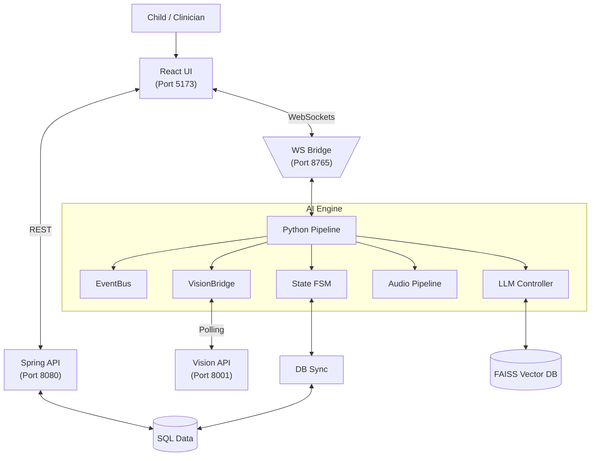
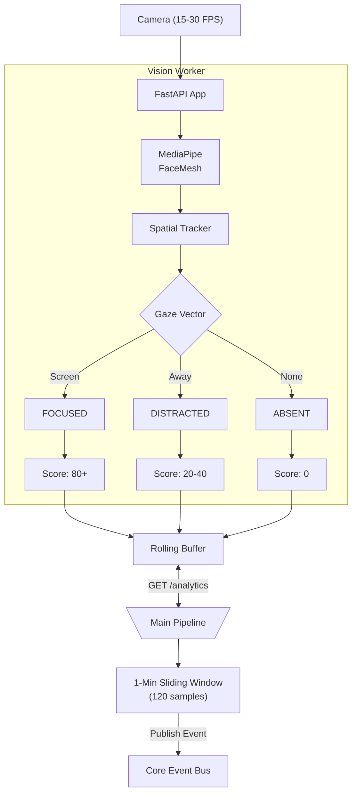
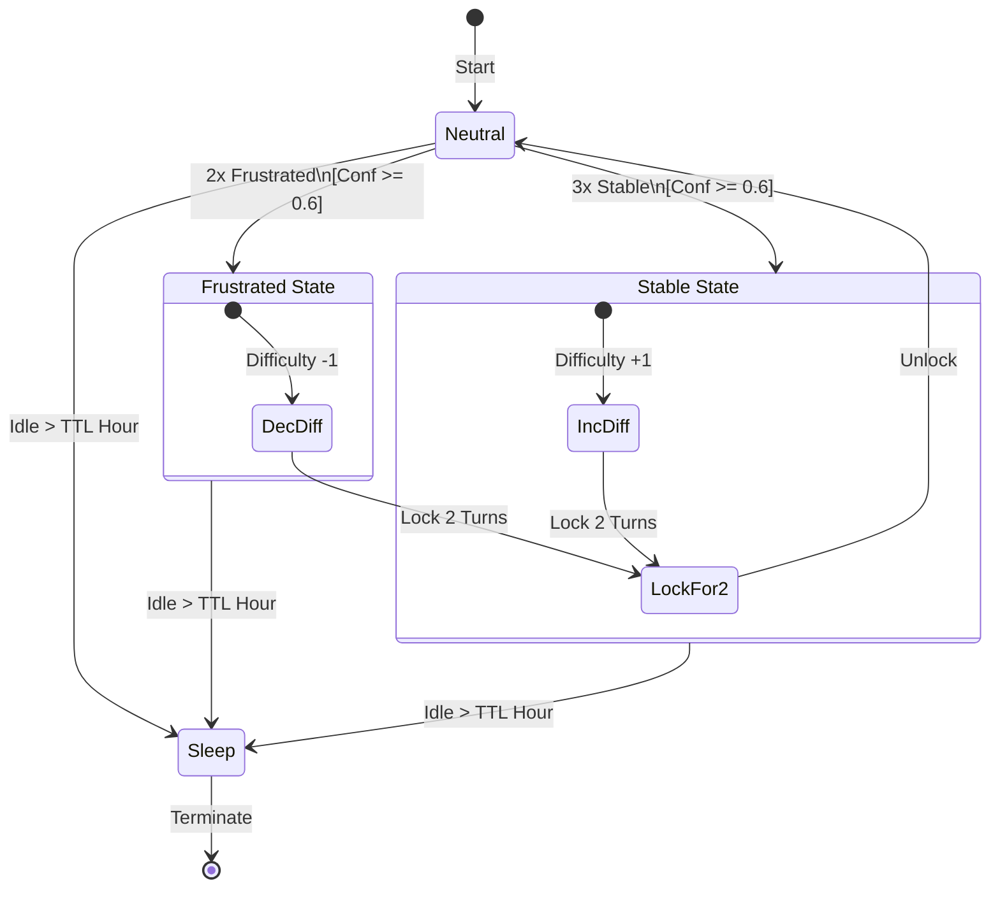
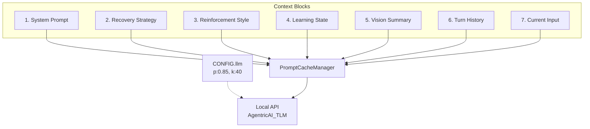
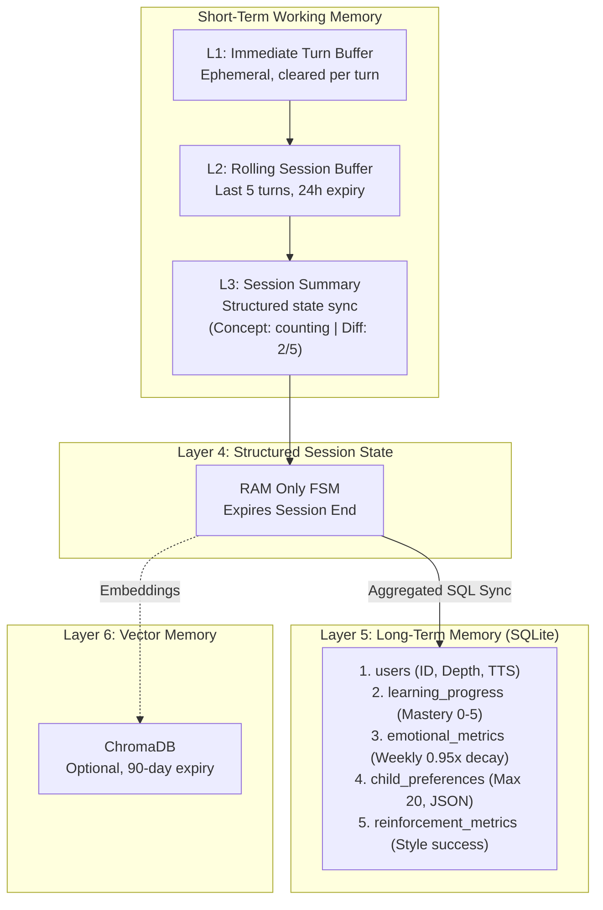
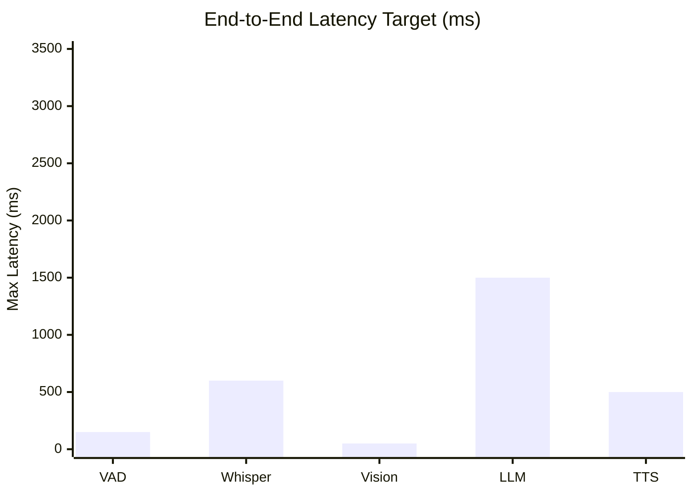
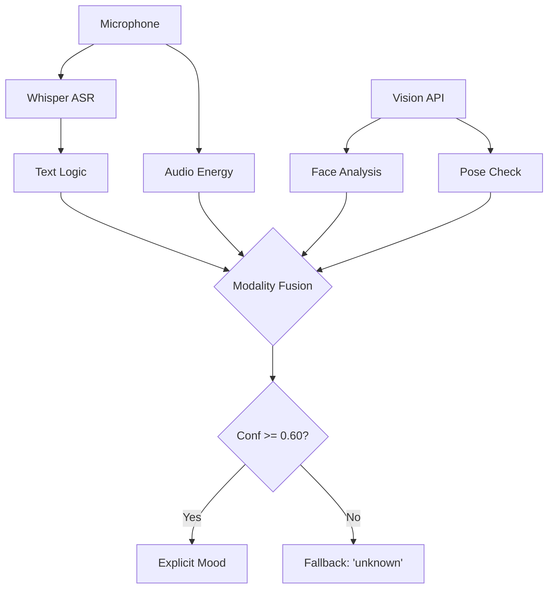
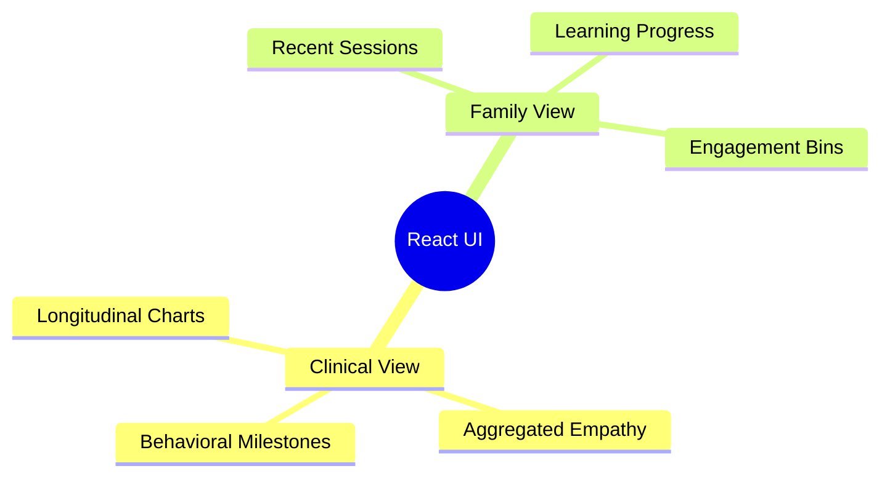
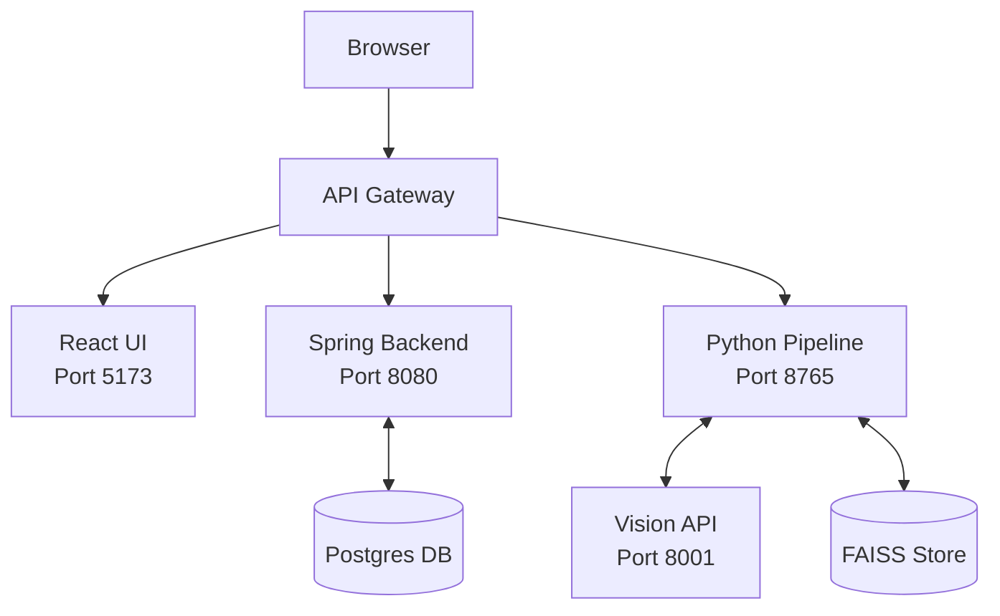
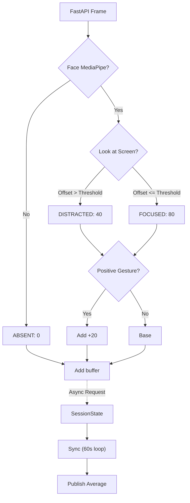

# LaRa Architecture Diagrams (2-Column Paper Optimized)

*Note: These diagrams have been strictly optimized for IEEE/ACM 2-column research paper formats. They exclusively use `TD` (Top-Down) layouts and stacked text labels to ensure they remain readable when scaled down to a ~3.5 inch column width.*

## Figure 1: LaRa System Overview

## Figure 2: Vision Perception Pipeline

## Figure 3: Session State Machine

## Figure 4: 7-Segment Prompt Architecture

## Figure 5: Memory Architecture

## Figure 6: Latency Breakdown Chart 

## Figure 7: Emotion Detection Stack

## Figure 8: Dashboard Architecture

## Figure 9: Deployment Architecture

## Figure 10: Engagement Scoring Algorithm

