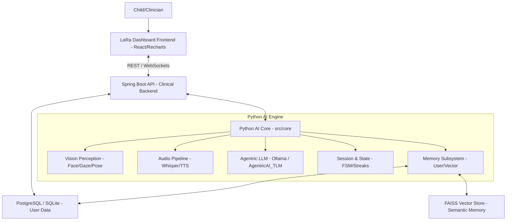
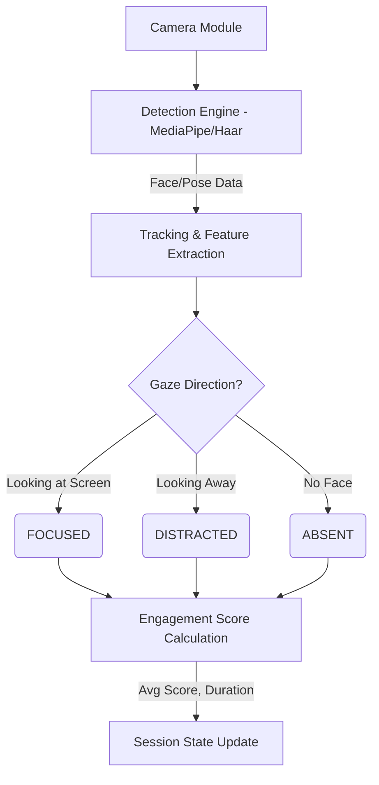
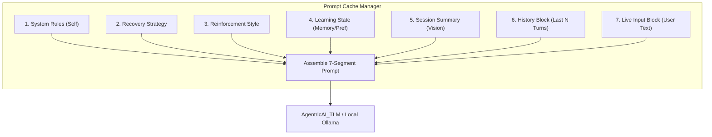
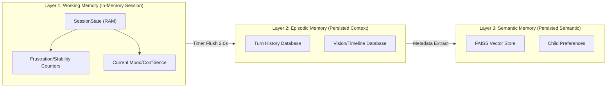
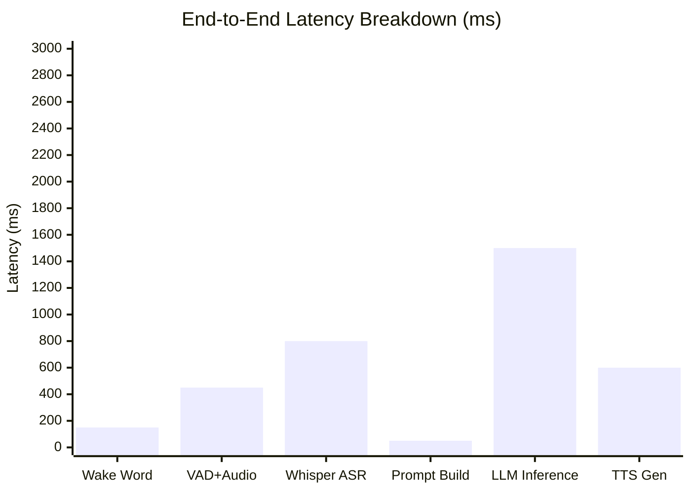
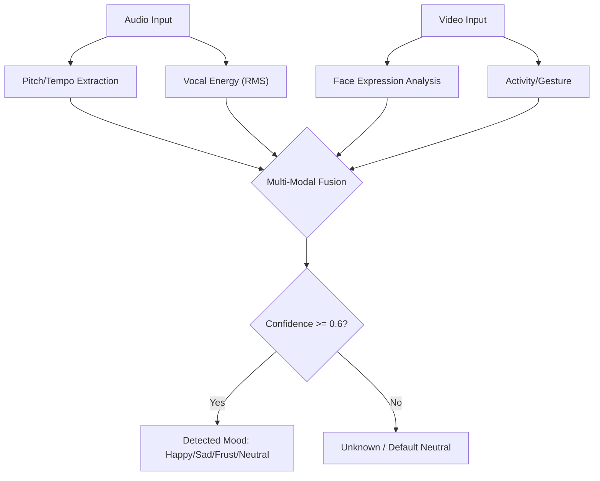
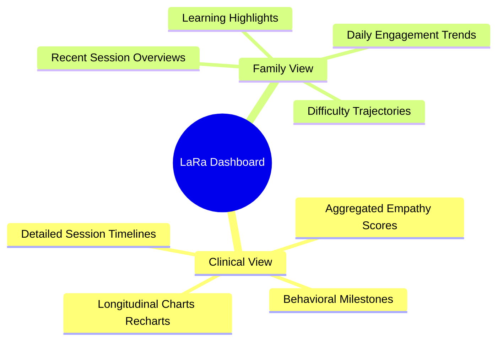
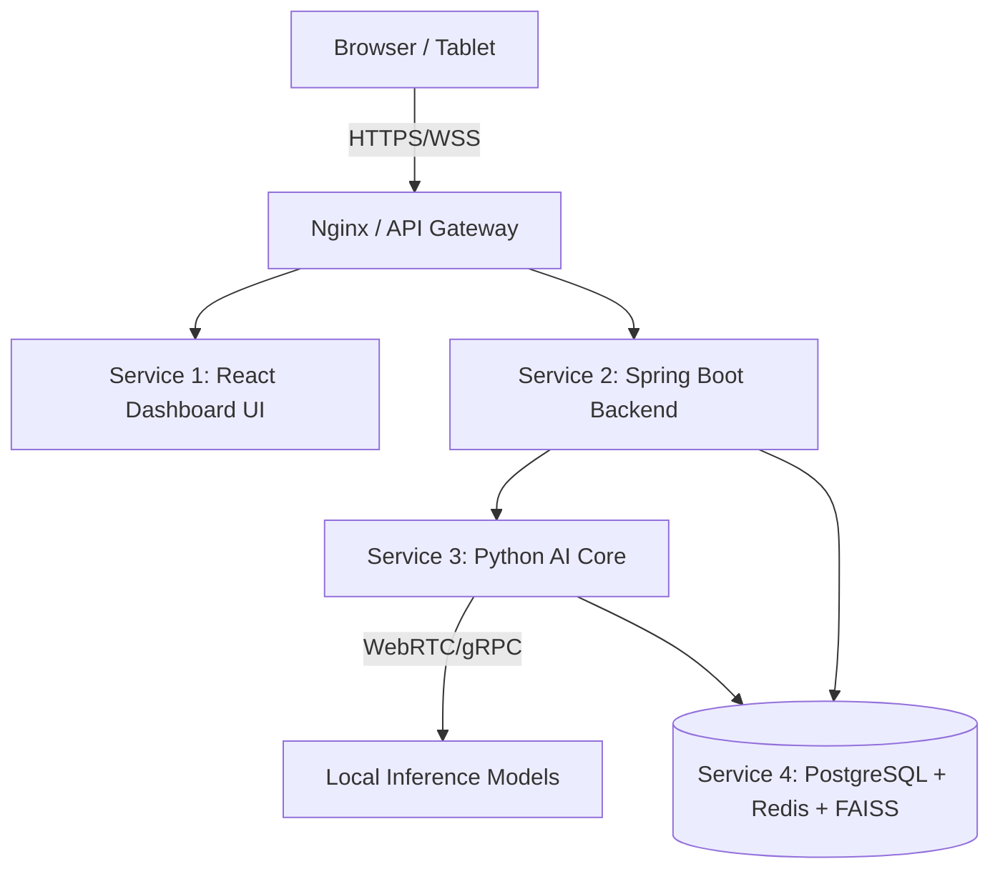
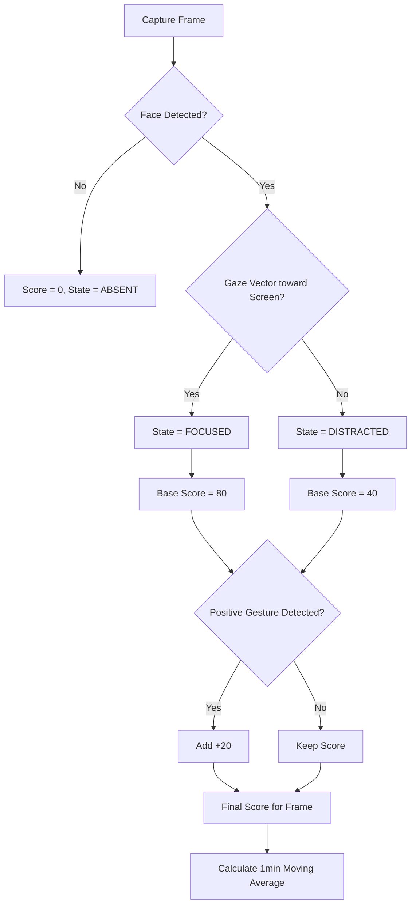

# LaRa Architecture Diagrams

Below are the architectural diagrams for the current version of the LaRa (Low-Cost Adaptive Robotic-AI Assistant) system, capturing all active engines, pipelines, and subsystems, rendered using Mermaid.

## Figure 1: LaRa System Overview (Full Block Diagram)

## Figure 2: Vision Perception Pipeline

## Figure 3: Session State Machine (FSM)

## Figure 4: 7-Segment Prompt Architecture

## Figure 5: Memory Architecture (3 Layers)

## Figure 6: Latency Breakdown Chart (Bar Chart)

## Figure 7: Emotion Detection Pipeline

## Figure 8: Dashboard Wireframe (Clinical + Family)

## Figure 9: Deployment Architecture (4 Services)

## Figure 10: Engagement Scoring Algorithm Flowchart

